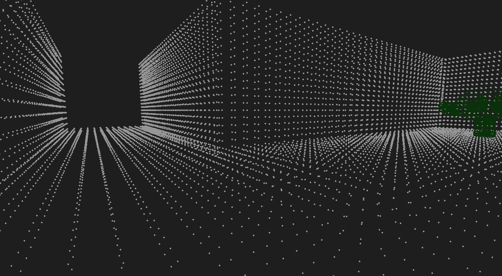

# Custom Game Engine
A project extended from my previous spinning donut project. It uses graphics programming knowledge to create a simple game from scratch

## 🧪 Demo



## 📦 Installation

How to get it up and running:

```bash
git clone https://github.com/Zarkibar/custom-game-engine.git
cd custom-game-engine
pip install -r requirements.txt
python main.py